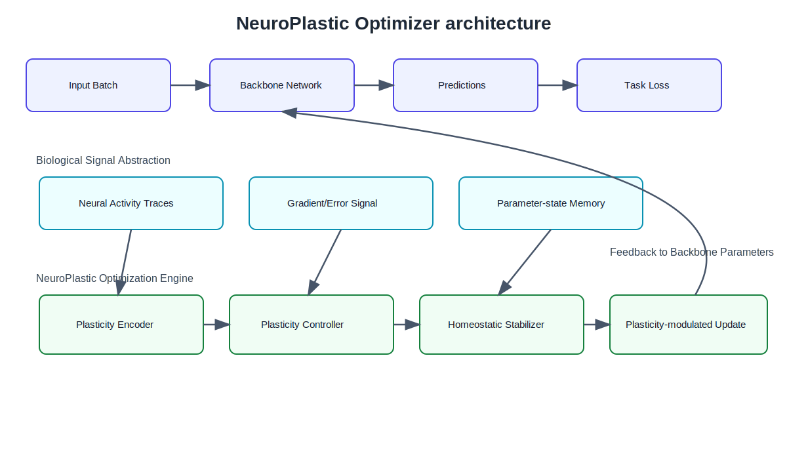

# NeuroPlastic Optimizer

NeuroPlastic Optimizer is a research-engineering framework for synaptic-plasticity-inspired optimization in PyTorch. It augments gradient-based updates with adaptive plasticity coefficients computed from local activity traces, gradient statistics, and parameter-state memory, while enforcing homeostatic stabilization to keep updates bounded.

## Positioning

This repository targets an applied-research use case:

- **Biological inspiration** is encoded as algorithmic signals (activity, memory, homeostatic control).
- **Engineering discipline** is prioritized through modular components, reproducible configs, and baseline comparisons.
- **Scientific utility** is supported by ablation-ready switches and consistent experiment artifacts.

The project does **not** claim biological fidelity or neuroscience simulation.

## Method overview

NeuroPlastic updates follow:

$$
\theta_{t+1} = \theta_t - \eta \, (\alpha_t \odot g_t)
$$

where $g_t = \nabla_{\theta_t}\mathcal{L}(\theta_t)$, and $\alpha_t$ combines:

$$
\alpha_t = \mathrm{clip}_{[\alpha_{\min},\alpha_{\max}]}\!\left(w_a\hat a_t + w_g\hat g_t + w_m\hat m_t\right)
$$

1. local activity traces (EMA of `|g_t|`),
2. gradient magnitude signal,
3. parameter-state memory (momentum/variance history),
4. bounded homeostatic stabilization.

### Plasticity modes

- `rule_based` (default): weighted fusion of activity, gradient, and memory signals.
- `ablation_grad_only`: gradient-driven ablation mode for controlled comparison.

## Architecture



*NeuroPlastic Optimizer augments gradient-based learning with synaptic-plasticity-inspired adaptive modulation. Local neural activity traces, gradient signals, and parameter-state memory are integrated by a plasticity encoder and controller to compute adaptive plasticity coefficients, while a homeostatic stabilization module constrains update magnitude for stable training.*

## Installation

```bash
python -m venv .venv
source .venv/bin/activate
pip install -e .[dev]
```

## Quickstart

### API usage

```python
from neuroplastic_optimizer import NeuroPlasticOptimizer

optimizer = NeuroPlasticOptimizer(model.parameters(), lr=1e-3)
```

### Run a single experiment

```bash
python -m neuroplastic_optimizer.training.runner --config configs/mnist/neuroplastic.yaml
```

Or use convenience scripts:

```bash
python scripts/train_mnist.py
python scripts/train_cifar10.py
```

## Benchmarks

Run the MNIST benchmark sweep (NeuroPlastic + ablation + SGD/Adam/AdamW):

```bash
python scripts/benchmark_all.py
```

Plot test accuracy curves:

```bash
python scripts/plot_results.py --result-files \
  results/neuroplastic_mnist_neuroplastic_metrics.json \
  results/ablation_grad_only_mnist_neuroplastic_metrics.json \
  results/adamw_mnist_adamw_metrics.json \
  results/adam_mnist_adam_metrics.json \
  results/sgd_mnist_sgd_metrics.json
```

## Focused MNIST tuning study

This repository also includes a targeted follow-up study for the question: `Can full NeuroPlastic outperform the grad-only ablation after targeted tuning?`

Run the tuning sweep:

```bash
python scripts/paper_figures/run_cpu_mnist_full_tuning_pipeline.py --epochs 10 --seeds 3 --skip-smoke
```

Generate the paper-ready tuning bundle:

```bash
python scripts/paper_figures/generate_mnist_full_tuning_figures.py --results-dir results_mnist_full_tuning_clean --output-dir paper_artifacts/mnist_full_tuning_clean
```

Outputs are written to dedicated directories so the existing clean MNIST paper artifacts remain unchanged:

- `results_mnist_full_tuning_clean/`
- `checkpoints_mnist_full_tuning_clean/`
- `paper_artifacts/mnist_full_tuning_clean/`

Current interpretation:
`On the completed MNIST partial study, full NeuroPlastic shows a small but consistent advantage over the grad-only ablation under the best finished tuning setting, but the gain is currently marginal and requires confirmation from the remaining sweep and a second dataset.`

## Fashion-MNIST validation study

After the final MNIST tuning study selects one recommended full NeuroPlastic config, validate that config against the grad-only ablation on Fashion-MNIST:

```bash
python scripts/paper_figures/run_cpu_fashionmnist_bestfull_vs_gradonly.py --epochs 10 --seeds 3 --skip-smoke --best-config configs/paper/best_full_neuroplastic_mnist.json
```

```bash
python scripts/paper_figures/generate_fashionmnist_bestfull_vs_gradonly_figures.py --results-dir results_fashionmnist_bestfull_vs_gradonly_clean --output-dir paper_artifacts/fashionmnist_bestfull_vs_gradonly_clean --best-config configs/paper/best_full_neuroplastic_mnist.json
```

Outputs are written to:

- `results_fashionmnist_bestfull_vs_gradonly_clean/`
- `checkpoints_fashionmnist_bestfull_vs_gradonly_clean/`
- `paper_artifacts/fashionmnist_bestfull_vs_gradonly_clean/`

## Current paper narrative

Full NeuroPlastic currently shows a small reproducible gain over the gradient-only ablation on MNIST, while the effect is stronger and more consistent on Fashion-MNIST. The next paper checks are therefore a locked-config CIFAR-10 validation and a low-data regime study to test whether the plasticity-inspired advantage becomes clearer when training data is limited.

Current evidence summary:

- MNIST: the locked best full config is slightly better than `ablation_grad_only` on mean final accuracy, mean best accuracy, and final loss, but the effect is marginal.
- Fashion-MNIST: the same locked best full config is more clearly better than `ablation_grad_only`, with stronger mean gaps and clean shared-seed wins.
- Next benchmarks: validate the same locked config on CIFAR-10 and measure the gap across `{0.1, 0.25, 0.5, 1.0}` data fractions.

## CIFAR-10 locked-config validation

Run the clean CIFAR-10 comparison:

```bash
python scripts/paper_figures/run_cifar10_bestfull_vs_gradonly.py --epochs 10 --seeds 3 --skip-smoke --best-config configs/paper/best_full_neuroplastic_mnist.json --output-root results_cifar10_bestfull_vs_gradonly_clean
```

Generate the CIFAR-10 artifact bundle:

```bash
python scripts/paper_figures/generate_cifar10_bestfull_vs_gradonly_figures.py --results-dir results_cifar10_bestfull_vs_gradonly_clean --output-dir paper_artifacts/cifar10_bestfull_vs_gradonly_clean --best-config configs/paper/best_full_neuroplastic_mnist.json
```

Outputs are written to:

- `results_cifar10_bestfull_vs_gradonly_clean/`
- `checkpoints_cifar10_bestfull_vs_gradonly_clean/`
- `paper_artifacts/cifar10_bestfull_vs_gradonly_clean/`

## Low-data best-full vs grad-only study

Run the default low-data Fashion-MNIST comparison:

```bash
python scripts/paper_figures/run_low_data_bestfull_vs_gradonly.py --dataset fashionmnist --fractions 0.1 0.25 0.5 1.0 --epochs 10 --seeds 3 --skip-smoke --best-config configs/paper/best_full_neuroplastic_mnist.json --output-root results_low_data_fashionmnist_bestfull_vs_gradonly_clean
```

Generate the low-data artifact bundle:

```bash
python scripts/paper_figures/generate_low_data_bestfull_vs_gradonly_figures.py --results-dir results_low_data_fashionmnist_bestfull_vs_gradonly_clean --output-dir paper_artifacts/low_data_fashionmnist_bestfull_vs_gradonly_clean --dataset fashionmnist
```

Outputs are written to:

- `results_low_data_fashionmnist_bestfull_vs_gradonly_clean/`
- `checkpoints_low_data_fashionmnist_bestfull_vs_gradonly_clean/`
- `paper_artifacts/low_data_fashionmnist_bestfull_vs_gradonly_clean/`

## Reproducibility and artifacts

Every run writes:

- `results/<run>_<dataset>_<optimizer>_metrics.json`
- `results/<run>_<dataset>_<optimizer>_summary.json`
- `checkpoints/<run>_<dataset>_<optimizer>_model.pt`

## Repository layout

```text
src/neuroplastic_optimizer/
  optimizer.py          # NeuroPlastic optimizer update rule
  plasticity.py         # plasticity coefficient computation
  traces.py             # activity trace extraction
  state.py              # parameter-state memory
  stabilization.py      # homeostatic constraints
  training/             # experiment runner, config parsing, data
  models/               # benchmark models
configs/                # YAML experiment definitions
scripts/                # benchmark orchestration and plotting
docs/                   # method, architecture, benchmark plan
tests/                  # unit and integration tests
assets/                 # figures
```

## Current limitations

- Current benchmarks are lightweight by design (MNIST/FashionMNIST/CIFAR-10).
- Text benchmark integration is scaffolded but not finalized.
- Distributed training and AMP orchestration are future work.

## Roadmap

- [ ] Finalize compact text classification benchmark.
- [ ] Add distributed and mixed-precision training support.
- [ ] Add richer diagnostics (alpha distribution, update norm traces).
- [ ] Publish reproducible benchmark tables with ablation summaries.

## Citation

```bibtex
@software{neuroplastic_optimizer_2026,
  title={NeuroPlastic Optimizer},
  author={NeuroPlastic Optimizer Contributors},
  year={2026},
  url={https://github.com/<org>/NeuroPlastic-Optimizer}
}
```
